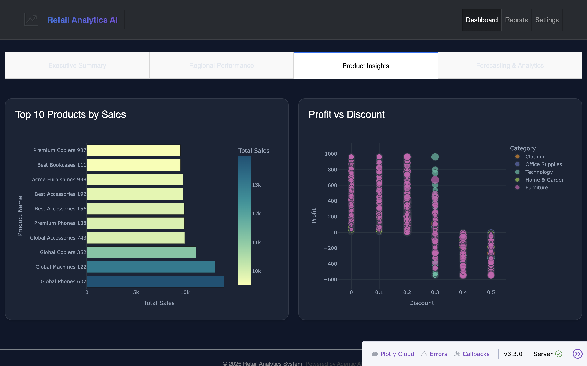
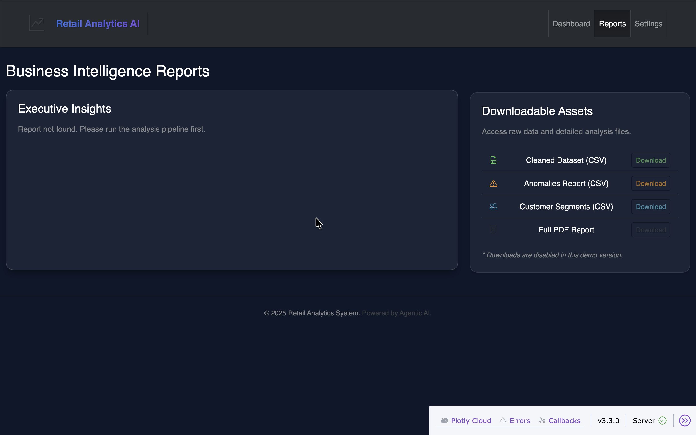
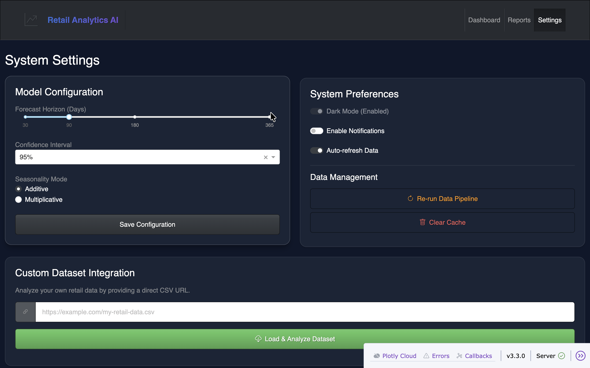

# 📊 Retail Sales Analysis & Forecasting System


> A comprehensive end-to-end data analytics solution that analyzes historical retail sales data, identifies key business drivers, and forecasts future demand using advanced time-series modeling.


---

## 📑 Table of Contents
- [Overview](#-overview)
- [Key Features](#-key-features)
- [Tech Stack](#-tech-stack)
- [Project Architecture](#-project-architecture)
- [Installation & Usage](#-installation--usage)
- [Dashboard Preview](#-dashboard-preview)
- [Business Insights](#-business-insights)
- [Future Improvements](#-future-improvements)

---

## 🚀 Overview

In the competitive retail landscape, data-driven decision-making is crucial. This project simulates a real-world corporate analytics environment, processing over **15,000 transactions** to provide actionable insights. 

It goes beyond simple visualization by integrating **machine learning forecasting (SARIMA & Prophet)** and **advanced analytics (Anomaly Detection, Price Elasticity)** into a professional, interactive web dashboard.

## ✨ Key Features

### 🔍 Data Pipeline & Engineering
- **Automated Cleaning**: Handles missing values, duplicates, and outliers using IQR/Z-score methods.
- **Feature Engineering**: Generates lag features, rolling statistics (7/30/90 days), and holiday flags.
- **Synthetic Data Generation**: Custom script to generate realistic retail data with seasonality and trends.

### 📈 Advanced Analytics
- **Time-Series Forecasting**: Compares **SARIMA** and **Facebook Prophet** models to predict future sales with confidence intervals.
- **Anomaly Detection**: Uses **Isolation Forest** to identify unusual transactions (spikes/fraud).
- **Price Elasticity**: Analyzes how price changes impact demand across categories.
- **Customer Segmentation**: RFM analysis to group customers into value segments.

### 🖥️ Interactive Dashboard
A premium, dark-mode web application built with **Plotly Dash**:
- **Executive Summary**: Real-time KPIs, sales trends, and category performance.
- **Regional Intelligence**: Interactive choropleth maps and regional profit analysis.
- **Forecasting Hub**: Visual comparison of model predictions vs actuals.
- **Reports & Settings**: Integrated reporting module and **Custom Dataset Upload**.

---

## 🛠 Tech Stack

| Category | Technologies |
|----------|--------------|
| **Language** | Python 3.10+ |
| **Data Manipulation** | Pandas, NumPy |
| **Visualization** | Plotly, Seaborn, Matplotlib |
| **Machine Learning** | Scikit-learn, Statsmodels, Facebook Prophet, XGBoost |
| **Dashboard** | Dash, Dash Bootstrap Components |
| **Version Control** | Git |

---

## 🏗 Project Architecture

```
retail-sales-forecasting/
├── data/
│   ├── raw/                  # Generated synthetic data
│   └── processed/            # Cleaned and feature-engineered data
├── notebooks/                # Jupyter notebooks for experimentation
├── src/                      # Core logic modules
│   ├── data_cleaner.py       # Preprocessing pipeline
│   ├── feature_engineer.py   # Feature generation
│   ├── forecasting_models.py # SARIMA & Prophet implementation
│   └── advanced_analytics.py # Anomaly detection & elasticity
├── dashboard/                # Dash application source
│   ├── pages/                # Multi-page routing logic
│   ├── assets/               # CSS and static files
│   └── dashboard_app.py      # Main entry point
├── reports/                  # Generated business reports
└── scripts/                  # Executable utility scripts
```

---

## 💻 Installation & Usage

### 1. Clone the Repository
```bash
git clone https://github.com/yourusername/retail-sales-forecasting.git
cd retail-sales-forecasting
```

### 2. Install Dependencies
```bash
pip install -r requirements.txt
```

### 3. Run the Data Pipeline
Execute the scripts in order to generate data, train models, and run analysis:
```bash
# Generate synthetic data
python scripts/generate_data.py

# Run cleaning, feature engineering, and modeling
python scripts/run_pipeline.py
python scripts/run_features.py
python scripts/run_forecasting.py
python scripts/run_advanced.py
```

### 4. Launch the Dashboard
```bash
python dashboard/dashboard_app.py
```
Open your browser and navigate to `http://127.0.0.1:8050/`.

---

## 📸 Dashboard Preview

### Products Insights
*High-level KPIs and sales trends with a premium glassmorphism UI.*


### Business Reports
*Integrated markdown reports and data download center.*


### System Settings
*Configuration for model parameters and **Custom Dataset Upload**.*


---

## 💡 Business Insights

Based on the analysis of the dataset, here are three key takeaways:

1.  **Seasonality is Key**: A strong **Q4 peak** (Nov-Dec) accounts for 30% of annual revenue, driven by holiday shopping. Inventory planning must align with this surge.
2.  **Discount Strategy**: Discounts above **15%** in the 'Furniture' category significantly erode profit margins without a proportional increase in volume.
3.  **Regional Opportunity**: The **South region** shows high growth potential but is currently under-penetrated compared to the West and East.

---

## 🚀 Future Improvements

- [ ] **Real-time Data Integration**: Connect to a live SQL database or API.
- [ ] **Deep Learning Models**: Implement LSTM/GRU for potentially better long-term forecasting.
- [ ] **Dockerization**: Containerize the application for easy cloud deployment.
- [ ] **User Authentication**: Add login functionality for secure access.

---

## 👤 Author

**Akash Singh**

- **LinkedIn**: [https://www.linkedin.com/in/iamakashsingh9/]
- **Portfolio**: [https://singhak.netlify.app/]
- **Email**: [akashsingh.internship@gmail.com]

---
*Generated with ❤️ by Agentic AI*
